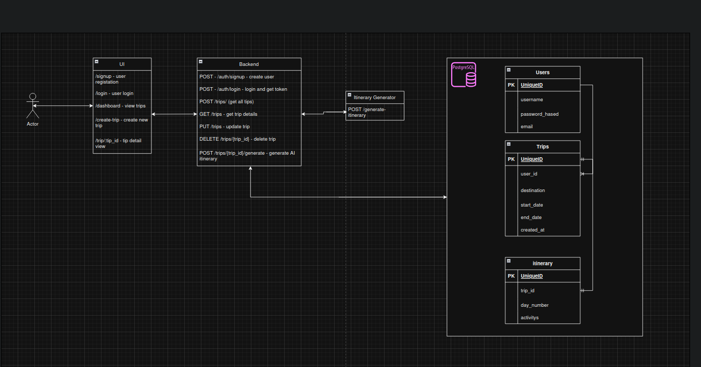

# TripPlanner

TripPlanner is a web-based trip planning platform built with a microservices architecture. It includes backend and frontend services that help users register, authenticate, and create custom travel itineraries. The project is containerized with Docker and orchestrated using Docker Compose.

## Architecture



## Project Structure

```
TripPlanner-main/
├── .idea/                     # Project metadata for JetBrains IDEs
├── backend/                  # FastAPI backend service
│   ├── Dockerfile
│   ├── database.py
│   ├── main.py               # Entry point of the FastAPI app
│   ├── models.py             # SQLAlchemy database models
│   ├── schemas.py            # Pydantic schemas
│   ├── requirements.txt
│   └── routes/               # API route definitions
│       ├── auth.py
│       └── trips.py
├── frontend/                 # Frontend React app
│   ├── Dockerfile
│   ├── package.json
│   └── public/index.html
├── docker-compose.yml        # Orchestration of all services
└── .gitignore
```

## Technologies Used

- **Backend**: FastAPI, SQLAlchemy, PostgreSQL
- **Frontend**: React (likely from `package.json`)
- **Containerization**: Docker, Docker Compose

## Getting Started

### Prerequisites

- Docker
- Docker Compose

### Run the project

From the root directory (`TripPlanner-main`), run the following command:

```bash
docker-compose up --build
```

This will start both the backend and frontend containers and link them together.

### Backend

- Runs on: `http://localhost:8000`
- Auto-generates interactive docs at: `http://localhost:8000/docs`

### Frontend

- Typically served on: `http://localhost:3000` (based on React default)

### Video Link - DEMO
https://www.youtube.com/watch?v=oCjrcqmn194

### .env file
This project require .env file to work.
example of .env:
```
POSTGRES_USER=
POSTGRES_PASSWORD=
DB_NAME=
SECRET_KEY=
TOGETHER_API_KEY=
```
to generate TOGETHER_API_KEY, go to 
`https://docs.together.ai/docs/quickstart`
you can generate with their guide
